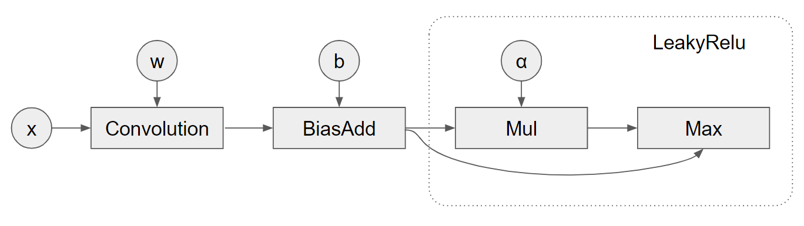

# CUDNN Frontend API Samples
CuDNN frontend/graph APIs support the concept of operation graph. Users can
define an operation graph and input it to CuDNN which will try to fuse it
and look for efficient kernels to execute the graph.

However, using such APIs involves many boilerplate codes and also requires the
understanding of the heuristics, since not all the engines meet our requirements
on precision/determinism/etc. A typical procedure is like:

1. Define the operation graph.
1. Obtain the list of heuristics engines.
1. Pick up one engine based on your requirements.
1. Prepare input data.
1. Call the engine.

We have to conduct these steps for any supported operation graphs, which is
tedious. Fortunately, only the step 1 and step 4 would differ for various
operation graphs. Therefore, the repo demonstrates a scalable code framework
that we've used in the Tensorflow and puts those reusable parts into callable
templates/functions. Then, hopefully, users can easily add new case to use the
new graph added by CuDNN.

The step 1 is defined in `graph_<graph_name>.h` and the step 4 is defined in
`test_<graph_name>.cpp`. For new patterns, users can simply modify these two
files. This repo already includes these patterns:

* `<conv>`: Conv (Precompiled Single Operation Engine)
* `<conv_add_bias_relu>`: Conv->Add->BiasAdd->Relu (Precompiled Specialized Engine)
* `<conv_bias_elu>`: Conv->BiasAdd->Elu (Runtime Fusion Engine)
* `<conv_bias_relu6>`: Conv->BiasAdd->Relu6 (Runtime Fusion Engine)
* `<conv_bias_leakyrelu>`: Conv->BiasAdd->LeakyRelu (Runtime Fusion Engine)

In the `graph_<graph_name>.h`, we propose a new way to represent the op graph
and this way users don't need to create the ops and virtual tensors.
```
{
  {"<op_name_1>", descriptor, scale_factors, edges},
  {"<op_name_2>", descriptor, scale_factors, edges},
  ...
}
```
For example, for the fusion pattern of `conv_bias_leakyrelu`, we need to create
a graph like below:



Users can simply use the following data structure to represent the graph and the
backend will help create the virtual tensors and operations and connect them
together. Note, this feature is still experimental and we only support
convolution ops and the most pointwise ops.
```c++
  std::vector<Node> nodes = {
      {"convolution", conv_desc, {1., 0.},
         /*edges=*/{{"x", &tensor_x}, {"w", &tensor_w}, {"y", ""}}},
      {"bias_add", bias_add_desc, {},
         /*edges=*/{{"x", "convolution:y"}, {"b", &tensor_b}, {"y", ""}}},
      {"mul", mul_desc, {},
         /*edges=*/{{"x", "bias_add:y"}, {"b", &scalar_tensor_alpha}, {"y", ""}}},
      {"max", max_desc, {},
         /*edges=*/{{"x", "bias_add:y"}, {"b", "mul:y"}, {"y", &tensor_y}}}};
```


# Usage
## Convolution graphs
For *the single node graph*, we can get the executable `test_conv.out` by
compiling the code with `make`. The users can easily adjust the convolution
configs and specify which CuDNN engine should be used. The supported list:

```
--inputs <4 or 5 integers with ','-separated and in the order of NCDHW>
--filter <4 or 5 integers with ','-separated and in the order of NCDHW>
--stride <2 or 3 integers with ','-separated and in the order of DHW>
--padding <2 or 3 integers with ','-separated and in the order of DHW>
--dilation <2 or 3 integers with ','-separated and in the order of DHW>
--data_format <0=NCHW, 1=NHWC>
--data_type <0=half, 1=float>
--conv_kind <0=fwd, 1=bwd_filter, 2=bwd_input>
--engine_index <Integer>
```

For example, the case below displays the convolution config the command's received
and the engines returned by the heuristics. It also prints the features (i.e.
numeric notes, behavior notes, and workspace bytes if available) associated with
each engine. At last, the convolution is done by using the specified 0th engine.
Note, in practice, one might want to sweep through all the engines, checking
their notes, and then pick up the fastest one.

```
$ ./test_conv.out --input 8,64,128,128,128 --filter 32,64,3,3,3 --data_format 1 \
 --data_type 1 --engine_index 0
>>> CONVOLUTION:
>>>   num_dims: 3,
>>>   input_dims: 8, 64, 128, 128, 128,
>>>   filter_dims: 32, 64, 3, 3, 3,
>>>   output_dims: 8, 32, 128, 128, 128,
>>>   input_strides: 134217728, 1, 1048576, 8192, 64,
>>>   filter_strides: 1728, 1, 576, 192, 64,
>>>   output_strides: 67108864, 1, 524288, 4096, 32,
>>>   paddings: 1, 1, 1,
>>>   strides: 1, 1, 1,
>>>   dilations: 1, 1, 1,
>>>   data_type(0=float,1=half): 1,
>>>   data_format(0=nchw,1=nhwc): 1,
>>>   conv_kind(0=fwd,1=bwd_filter,2=bwd_input): 0,

Filtered engine configs size: 43
Adding engine (0): ConvFwd_eng16_k2=16_k13=0_k14=0_k18=0_k23=0
  Numeric Notes: CUDNN_NUMERICAL_NOTE_TENSOR_CORE,
Adding engine (1): ConvFwd_eng16_k2=16_k13=0_k14=0_k18=1_k23=0
  Numeric Notes: CUDNN_NUMERICAL_NOTE_TENSOR_CORE,
...
Returned execution plans size: 42
Using (0): ConvFwd_eng16_k2=16_k13=0_k14=0_k18=0_k23=0
>>> Convolution Finished.
```

For *the fused convolution graph*, we simply change the target to
`test_fused_conv` and recompile the code. The `--bias` option is
required for the test. For example, we can see the `ConvFwd_Add_Add_ReluFwd`
engines are returned when we add `--bias` option.
```
$ ./test_conv_add_bias_relu.out --input 8,64,128,128,128 --filter 32,64,3,3,3 \
  --bias 1,32,1,1,1 --data_format 1 --data_type 1 --engine_index 0
>>> CONVOLUTION:
>>>   num_dims: 3,
>>>   input_dims: 8, 64, 128, 128, 128,
>>>   filter_dims: 32, 64, 3, 3, 3,
>>>   bias_dims: 1, 32, 1, 1, 1,
>>>   output_dims: 8, 32, 128, 128, 128,
>>>   input_strides: 134217728, 1, 1048576, 8192, 64,
>>>   filter_strides: 1728, 1, 576, 192, 64,
>>>   bias_strides: 32, 1, 32, 32, 32,
>>>   output_strides: 67108864, 1, 524288, 4096, 32,
>>>   paddings: 1, 1, 1,
>>>   strides: 1, 1, 1,
>>>   dilations: 1, 1, 1,
>>>   data_type(0=float,1=half): 1,
>>>   data_format(0=nchw,1=nhwc): 1,
>>>   conv_kind(0=fwd,1=bwd_filter,2=bwd_input): 0,

Filtered engine configs size: 39
Adding engine (0): ConvFwd_Add_Add_ReluFwd_eng8_k2=16_k13=0_k14=0_k18=0_k23=0
  Numeric Notes: CUDNN_NUMERICAL_NOTE_TENSOR_CORE,
Adding engine (1): ConvFwd_Add_Add_ReluFwd_eng8_k2=16_k13=0_k14=0_k18=1_k23=0
  Numeric Notes: CUDNN_NUMERICAL_NOTE_TENSOR_CORE,
...
Returned execution plans size: 38
Using (0): ConvFwd_Add_Add_ReluFwd_eng8_k2=16_k13=0_k14=0_k18=0_k23=0
>>> Convolution Finished.
```

