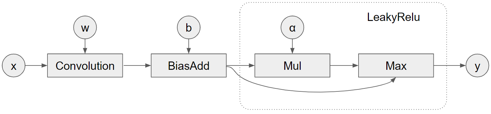
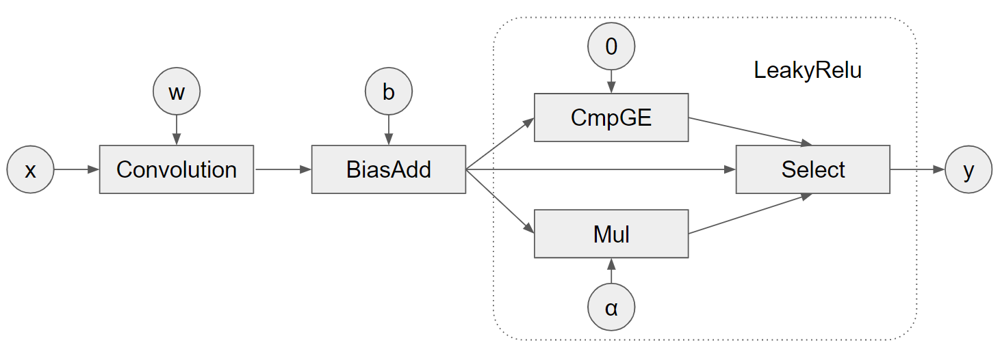

# CUDNN Frontend API Samples
CuDNN frontend/graph APIs support the concept of operation graph. Users can
define an operation graph and input it to CuDNN which will try to fuse it
and look for efficient kernels to execute the graph.

However, using such APIs involves many boilerplate codes and also requires the
understanding of the heuristics, since not all the engines meet our requirements
on precision/determinism/etc. A typical procedure is like:

1. Define the operation graph.
1. Obtain the list of heuristics engines.
1. Pick up one engine based on your requirements.
1. Prepare input data.
1. Call the engine.

We have to conduct these steps for any supported operation graphs, which is
tedious. Fortunately, only the step 1 and step 4 would differ for various
operation graphs. Therefore, the repo demonstrates a scalable code framework
that we've used in the Tensorflow and puts those reusable parts into callable
templates/functions. Then, hopefully, users can easily add new case to use the
new graph added by CuDNN.

The step 1 is defined in `graph_<graph_name>.h` and the step 4 is defined in
`test_<graph_name>.cpp`. For new patterns, users can simply modify these two
files. This repo already includes these patterns:

* `<conv>`: Conv (Precompiled Single Operation Engine)
* `<conv_add_bias_relu>`: Conv->Add->BiasAdd->Relu (Precompiled Specialized Engine)
* `<conv_bias_elu>`: Conv->BiasAdd->Elu (Runtime Fusion Engine)
* `<conv_bias_relu6>`: Conv->BiasAdd->Relu6 (Runtime Fusion Engine)
* `<conv_bias_leakyrelu>`: Conv->BiasAdd->LeakyRelu (Runtime Fusion Engine)

## Graph Representation
Typically, users need to manually build the edges ("virtual tensors") and nodes
("operations") to create the fusion graph for cudnn calls. We found this might
be verbose and error-prone, so we propose an equivalent but more concise way to
achieve this: users can represent the fusion graph with a list of operations
with their input and output ports. Then, we will analyze the list and add the
cudnn virtual tensors and operations, and wire them together.

```c++
{
  {"op1", op1_dtype, &op1_desc, {/*scaling factors*/}, {{"x", &tensor_x}, {"y", ""}},
  {"op2", op2_dtype, &op2_desc, {/*scaling factors*/}, {{"x", "op1:y"}, {"y", ""}}},
  // ...
}
```
Note, the `op_desc` is optional if the corresponding op is pointwise. The `""`
indicates we'd like the backend to create the virtual tensor for us.
Alternatively, it can be replace by a manually created tensor descriptor when we
want to fetch the intermediate results or specify the data type if the model is
senstive to type casting of intermediate results.

We will use the leakyrelu in the `conv_bias_leakyrelu` pattern as an example to show how to use the list. In fact, leakyrelu is supported in the cudnn relu op by setting the `setReluLowerClipSlope()`. However, for illustration purpose, we will use the following two equivalent formulas to represent the pattern:
### LeakyRelu Pattern 1:
```python
leakyrelu(x) = max(x, mul(x, alpha))
```

```c++
std::vector<Node> nodes = {
      {"convolution", accumulator_type, &conv_desc, {1., 0.},
         /*ports=*/{{"x", &tensor_x}, {"w", &tensor_w}, {"y", ""}}},
      {"bias_add", accumulator_type, nullptr, {},
         /*ports=*/{{"x", "convolution:y"}, {"b", &tensor_b}, {"y", ""}}},
      {"mul", activation_type, nullptr, {},
         /*ports=*/{{"x", "bias_add:y"}, {"b", &scalar_tensor_alpha}, {"y", ""}}},
      {"max", activation_type, nullptr, {},
         /*ports=*/{{"x", "bias_add:y"}, {"b", "mul:y"}, {"y", &tensor_y}}}};
```
### LeakyRelu Pattern 2:
```python
leakyrelu(x) = x if x >= 0 else alpha * x;
```


```c++
  std::vector<Node> nodes = {
      {"convolution", accumulator_type, &conv_desc, {1., 0.},
         /*ports=*/{{"x", &tensor_x}, {"w", &tensor_w}, {"y", ""}}},
      {"bias_add", accumulator_type, nullptr, {},
         /*ports=*/{{"x", "convolution:y"}, {"b", &tensor_b}, {"y", ""}}},
      {"cmp_ge", activation_type, nullptr, {},
         /*ports=*/{{"x", "bias_add:y"}, {"b", &scalar_tensor_zero}, {"y", ""}}},
      {"mul", activation_type, nullptr, {},
         /*ports=*/{{"x", "bias_add:y"}, {"b", &scalar_tensor_alpha}, {"y", ""}}},
      {"select", activation_type, nullptr, {},
         /*ports=*/{{"x", "bias_add:y"}, {"b", "mul:y"}, {"t", "cmp_ge:y"}, {"y", &tensor_y}}}};
```

Note, this feature is still in the experimental stage. For a more general support, there are places that need to be improved:
* The virtual tensor dtype is inferred from the corresponding op. Ideally, its
  dtype should be consistent with the subsequent ops to avoid unnecessary type
  conversion.
* The virtual tensor's output shape is simply copied from the real output tensor
  which we assume there is only one in the graph. Ideally, the output shape of
  each virtual tensor should be inferred from its corresponding input tensor and
  operation.


# Usage
## Convolution graphs
For *the single node graph*, we can get the executable `test_conv.out` by
compiling the code with `make`. The users can easily adjust the convolution
configs and specify which CuDNN engine should be used. The supported list:

```
--inputs <4 or 5 integers with ','-separated and in the order of NCDHW>
--filter <4 or 5 integers with ','-separated and in the order of NCDHW>
--stride <2 or 3 integers with ','-separated and in the order of DHW>
--padding <2 or 3 integers with ','-separated and in the order of DHW>
--dilation <2 or 3 integers with ','-separated and in the order of DHW>
--data_format <0=NCHW, 1=NHWC>
--data_type <0=half, 1=float>
--conv_kind <0=fwd, 1=bwd_filter, 2=bwd_input>
--engine_index <Integer>
```

For example, the case below displays the convolution config the command's received
and the engines returned by the heuristics. It also prints the features (i.e.
numeric notes, behavior notes, and workspace bytes if available) associated with
each engine. At last, the convolution is done by using the specified 0th engine.
Note, in practice, one might want to sweep through all the engines, checking
their notes, and then pick up the fastest one.

```
$ ./test_conv.out --input 8,64,128,128,128 --filter 32,64,3,3,3 --data_format 1 \
 --data_type 1 --engine_index 0
>>> CONVOLUTION:
>>>   num_dims: 3,
>>>   input_dims: 8, 64, 128, 128, 128,
>>>   filter_dims: 32, 64, 3, 3, 3,
>>>   output_dims: 8, 32, 128, 128, 128,
>>>   input_strides: 134217728, 1, 1048576, 8192, 64,
>>>   filter_strides: 1728, 1, 576, 192, 64,
>>>   output_strides: 67108864, 1, 524288, 4096, 32,
>>>   paddings: 1, 1, 1,
>>>   strides: 1, 1, 1,
>>>   dilations: 1, 1, 1,
>>>   data_type(0=float,1=half): 1,
>>>   data_format(0=nchw,1=nhwc): 1,
>>>   conv_kind(0=fwd,1=bwd_filter,2=bwd_input): 0,

Filtered engine configs size: 43
Adding engine (0): ConvFwd_eng16_k2=16_k13=0_k14=0_k18=0_k23=0
  Numeric Notes: CUDNN_NUMERICAL_NOTE_TENSOR_CORE,
Adding engine (1): ConvFwd_eng16_k2=16_k13=0_k14=0_k18=1_k23=0
  Numeric Notes: CUDNN_NUMERICAL_NOTE_TENSOR_CORE,
...
Returned execution plans size: 42
Using (0): ConvFwd_eng16_k2=16_k13=0_k14=0_k18=0_k23=0
>>> Convolution Finished.
```

For *the fused convolution graph*, we simply change the target to
`test_fused_conv` and recompile the code. The `--bias` option is
required for the test. For example, we can see the `ConvFwd_Add_Add_ReluFwd`
engines are returned when we add `--bias` option.
```
$ ./test_conv_add_bias_relu.out --input 8,64,128,128,128 --filter 32,64,3,3,3 \
  --bias 1,32,1,1,1 --data_format 1 --data_type 1 --engine_index 0
>>> CONVOLUTION:
>>>   num_dims: 3,
>>>   input_dims: 8, 64, 128, 128, 128,
>>>   filter_dims: 32, 64, 3, 3, 3,
>>>   bias_dims: 1, 32, 1, 1, 1,
>>>   output_dims: 8, 32, 128, 128, 128,
>>>   input_strides: 134217728, 1, 1048576, 8192, 64,
>>>   filter_strides: 1728, 1, 576, 192, 64,
>>>   bias_strides: 32, 1, 32, 32, 32,
>>>   output_strides: 67108864, 1, 524288, 4096, 32,
>>>   paddings: 1, 1, 1,
>>>   strides: 1, 1, 1,
>>>   dilations: 1, 1, 1,
>>>   data_type(0=float,1=half): 1,
>>>   data_format(0=nchw,1=nhwc): 1,
>>>   conv_kind(0=fwd,1=bwd_filter,2=bwd_input): 0,

Filtered engine configs size: 39
Adding engine (0): ConvFwd_Add_Add_ReluFwd_eng8_k2=16_k13=0_k14=0_k18=0_k23=0
  Numeric Notes: CUDNN_NUMERICAL_NOTE_TENSOR_CORE,
Adding engine (1): ConvFwd_Add_Add_ReluFwd_eng8_k2=16_k13=0_k14=0_k18=1_k23=0
  Numeric Notes: CUDNN_NUMERICAL_NOTE_TENSOR_CORE,
...
Returned execution plans size: 38
Using (0): ConvFwd_Add_Add_ReluFwd_eng8_k2=16_k13=0_k14=0_k18=0_k23=0
>>> Convolution Finished.
```

